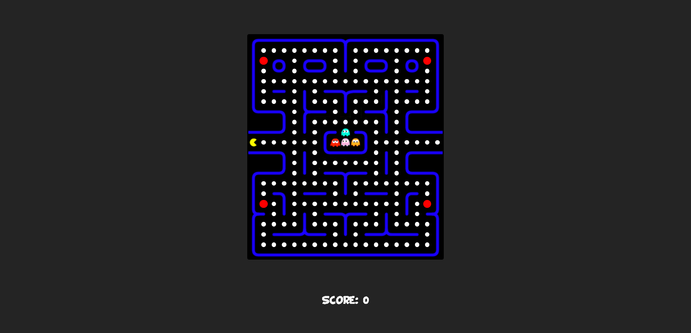

	<h1 align="left">Pac-Man</h1>

Simple Pacman game created by using Javascript, HTML , CSS

	

---

	<h2 align="left">About</h2>

Pacman is a nostalgic and memorable game that was designed by Toru Iwatani and released on arcade in 1980.
I decided to code and publish this game using Javascript, HTML, CSS
